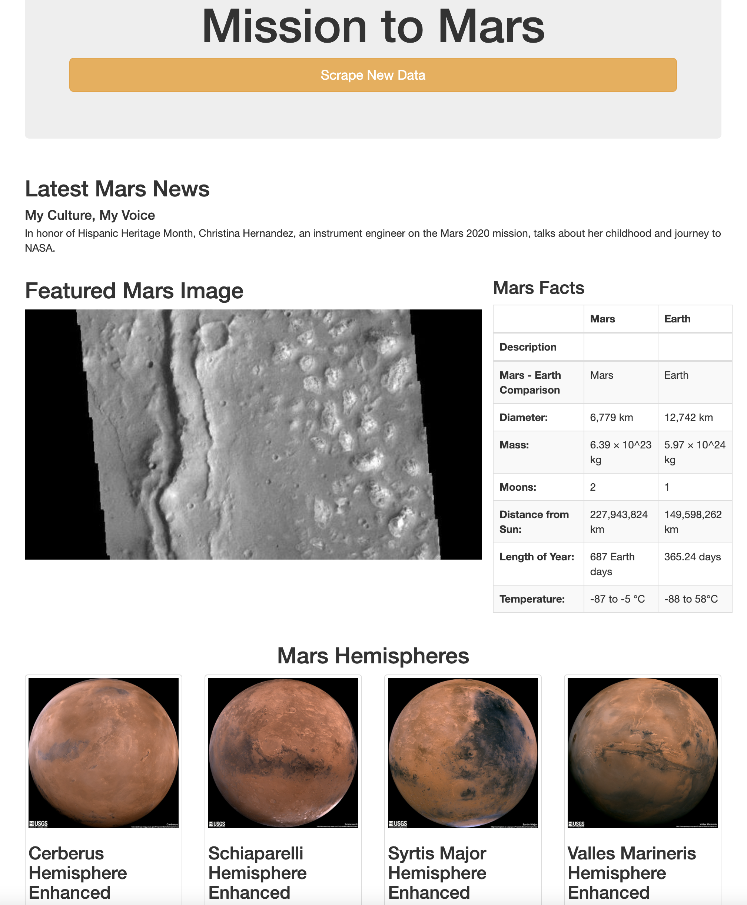

# Mission to Mars

## Overview of Analysis
The purpose of this analysis is to scrape data about Mars from various websites and present the information on a webpage. The web scraping and data gathering was done using BeautifulSoup, Splinter, Python, and Web-Driver Manager. The data is then stored, updated, and presented using Flask, MongoDB, and HTML.  

The webpage has four focuses. It showcases the latest Mars news by displaying the title and description of a recent article from [Red Planet Science](https://data-class-mars.s3.amazonaws.com/Mars/index.html#). Second, the webpage displays a featured image of Mar's surface from the [Jet Propulsion Laboratory](https://spaceimages-mars.com/). Additionally, it presents an information table from [Galaxy Facts](https://galaxyfacts-mars.com) comparing Mars and Earth including information about their sizes, number of moons, temperatures, etc. And finally, the webpage displays [GUSS Science Center's](https://marshemispheres.com/) labeled images of the Mars hemispheres. 

